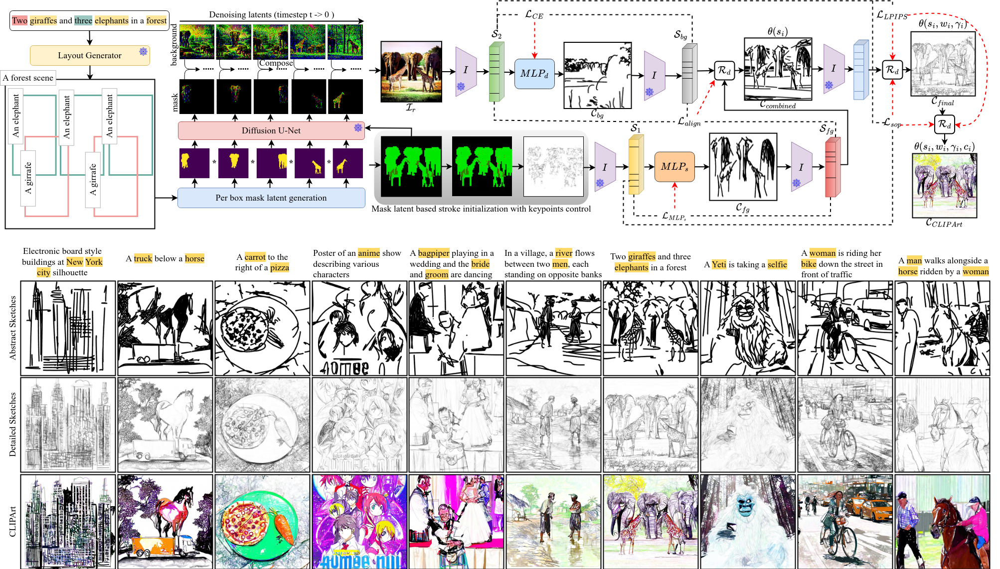

# SVGCraft

## Description
Pytorch implementation of the paper [SVGCraft: Beyond Single Object Text-to-SVG Synthesis with Comprehensive Canvas Layout](https://arxiv.org/abs/2404.00412). For more information, Please check at: https://svgcraf.github.io




## Citation

If you find this useful for your research, please cite it as follows:

```bash
@article{banerjee2024svgcraft,
  title={SVGCraft: Beyond Single Object Text-to-SVG Synthesis with Comprehensive Canvas Layout},
  author={Banerjee, Ayan and Mathur, Nityanand and Llad{\'o}s, Josep and Pal, Umapada and Dutta, Anjan},
  journal={arXiv preprint arXiv:2404.00412},
  year={2024}
}
```

## Acknowledgement

Many thanks to these excellent opensource projects 
* [Diffvg](https://github.com/BachiLi/diffvg) 
* [LLM-grounded diffusion](https://github.com/TonyLianLong/LLM-groundedDiffusion)

## Conclusion
Thank you for your interest in our work, and sorry if there are any bugs.

